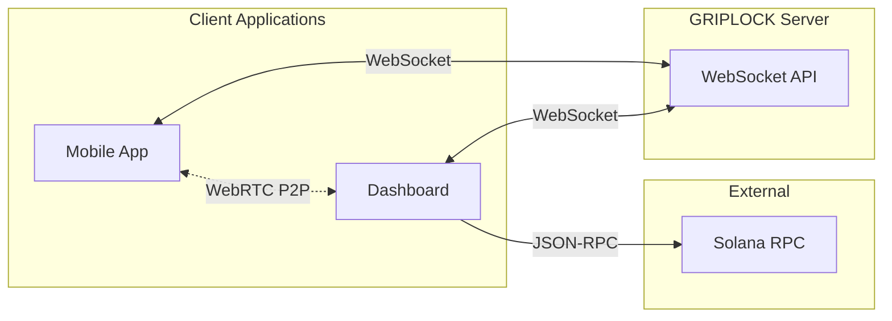

# API Overview

GRIPLOCK exposes several APIs for communication between components. This reference covers the signaling server WebSocket API and message payload formats.

## API Types

| API | Protocol | Purpose |
|-----|----------|---------|
| **Signaling API** | WebSocket | Connection establishment and message relay |
| **Data Channel API** | WebRTC | Peer-to-peer encrypted data transfer |
| **Blockchain API** | JSON-RPC | Solana mainnet queries |

## Architecture



## Signaling Server

The signaling server facilitates WebRTC connection establishment:

### Endpoint

```
wss://app.griplock.io/ws
ws://localhost:5000/ws  (development)
```

### Connection Flow

1. Dashboard connects and registers with session ID
2. Mobile scans QR and connects with same session ID
3. Server relays WebRTC signaling messages
4. P2P connection established, server role ends

### Message Types

| Type | Direction | Purpose |
|------|-----------|---------|
| `register_dashboard` | Dashboard → Server | Join session as dashboard |
| `register_mobile` | Mobile → Server | Join session as mobile |
| `mobile_connected` | Server → Dashboard | Notify of mobile presence |
| `answer` | Mobile → Server → Dashboard | WebRTC answer SDP |
| `ice_candidate` | Bidirectional | ICE candidate exchange |
| `encrypted_credentials` | Mobile → Dashboard | Encrypted wallet data |

## WebRTC Data Channel

After signaling completes, a direct P2P channel carries encrypted data:

### Channel Properties

| Property | Value |
|----------|-------|
| Label | `griplock-data` |
| Ordered | `true` |
| Max Retransmits | Unlimited |

### Message Format

All data channel messages are JSON-encoded:

```typescript
interface DataChannelMessage {
  type: string;
  [key: string]: unknown;
}
```

## Solana RPC

The dashboard queries Solana mainnet directly:

### Endpoint

```
https://api.mainnet-beta.solana.com
```

### Methods Used

| Method | Purpose |
|--------|---------|
| `getBalance` | SOL balance for address |
| `getTokenAccountsByOwner` | SPL token holdings |
| `getSignaturesForAddress` | Transaction history |

### Rate Limits

Public Solana RPC has rate limits. For production deployments, consider:

- Private RPC endpoints (QuickNode, Alchemy, Helius)
- Caching layer for balance/token queries
- Request batching where possible

## Authentication

### Session-Based

Each connection is associated with a session ID:

```typescript
// Session ID format
const sessionId = crypto.randomUUID();
// Example: "a1b2c3d4-e5f6-7890-abcd-ef1234567890"
```

### No API Keys

The signaling server doesn't require API keys. Security relies on:

1. Ephemeral session IDs
2. End-to-end encryption
3. WebRTC peer verification

## Error Handling

### WebSocket Errors

| Code | Meaning | Action |
|------|---------|--------|
| 1000 | Normal close | Reconnect if needed |
| 1001 | Going away | Server shutdown, retry later |
| 1006 | Abnormal close | Network issue, retry with backoff |

### RPC Errors

```typescript
interface RPCError {
  code: number;
  message: string;
}
```

| Code | Meaning |
|------|---------|
| -32600 | Invalid request |
| -32601 | Method not found |
| -32602 | Invalid params |
| -32700 | Parse error |
| 429 | Rate limited |

## SDK Integration

### JavaScript/TypeScript

```typescript
// Connect to signaling server
const ws = new WebSocket('wss://app.griplock.io/ws');

// Register dashboard
ws.send(JSON.stringify({
  type: 'register_dashboard',
  sessionId: 'your-session-id'
}));

// Handle messages
ws.onmessage = (event) => {
  const message = JSON.parse(event.data);
  switch (message.type) {
    case 'mobile_connected':
      // Mobile joined session
      break;
    case 'answer':
      // Process WebRTC answer
      break;
  }
};
```

### Mobile (React Native)

```typescript
import { RTCPeerConnection, RTCSessionDescription } from 'react-native-webrtc';

// Parse QR payload
const payload = decompressQRData(qrContent);

// Create peer connection
const pc = new RTCPeerConnection(rtcConfig);

// Set remote description (offer from dashboard)
await pc.setRemoteDescription(
  new RTCSessionDescription({
    type: 'offer',
    sdp: payload.sdp
  })
);

// Create and send answer
const answer = await pc.createAnswer();
await pc.setLocalDescription(answer);
```

## Next Steps

<CardGroup cols={2}>
  <Card title="WebSocket API" icon="plug" href="/api-reference/websocket">
    Detailed WebSocket message reference
  </Card>
  <Card title="Payload Formats" icon="file-code" href="/api-reference/payloads">
    Data structure specifications
  </Card>
</CardGroup>
