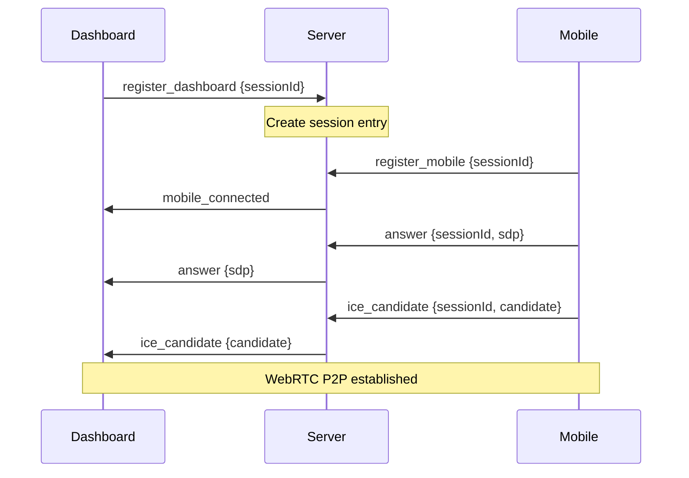

# System Components

This document provides detailed specifications for each component in the GRIPLOCK system.

## Dashboard Application

The web-based dashboard is built with React and serves as the primary user interface.

### Technology Stack

| Technology | Version | Purpose |
|------------|---------|---------|
| React | 18.x | UI framework |
| TypeScript | 5.x | Type safety |
| Wouter | 3.x | Client-side routing |
| TanStack Query | 5.x | Server state management |
| Tailwind CSS | 4.x | Styling |
| Shadcn UI | Latest | Component library |

### Key Modules

<Tabs>
  <Tab title="Crypto Engine">
    **File:** `client/src/lib/crypto.ts`
    
    Provides all cryptographic operations:
    
    ```typescript
    // Key generation
    export function generateKeyPair(): KeyPair
    
    // Key exchange
    export function deriveSharedSecret(
      privateKey: Uint8Array, 
      peerPublicKey: Uint8Array
    ): Uint8Array
    
    // Encryption/Decryption
    export function encryptPayload(data, sharedSecret): EncryptedPayload
    export function decryptPayload(encrypted, sharedSecret): DecryptedWalletData
    
    // Wallet derivation
    export function deriveSolanaAddress(nfcId: string, pin: string): string
    
    // Session storage encryption
    export function encryptForStorage(data, sessionId, ttlMinutes): EncryptedStorageData
    export function decryptFromStorage(encrypted, sessionId): StoredWalletData | null
    ```
    
    **Dependencies:**
    - `@noble/curves` — Ed25519 and X25519 implementations
    - `@noble/hashes` — SHA-256 and HKDF
    - `@noble/ciphers` — AES-GCM encryption
  </Tab>
  <Tab title="Solana Client">
    **File:** `client/src/lib/solana.ts`
    
    Direct JSON-RPC communication with Solana mainnet:
    
    ```typescript
    // Balance queries
    export async function getSolBalance(address: string): Promise<SolanaBalance>
    export async function getTokenAccounts(address: string): Promise<TokenBalance[]>
    
    // Transaction history
    export async function getRecentTransactions(
      address: string, 
      limit?: number
    ): Promise<SolanaTransaction[]>
    
    // Formatting utilities
    export function formatAddress(address: string): string
    export function formatTimestamp(timestamp: number | null): string
    ```
    
    **RPC Endpoint:** `https://api.mainnet-beta.solana.com`
  </Tab>
  <Tab title="WebRTC Hook">
    **File:** `client/src/hooks/useWebRTC.ts`
    
    Manages the WebRTC lifecycle:
    
    ```typescript
    interface WebRTCState {
      status: 'idle' | 'generating' | 'ready' | 'connected' | 'received' | 'error';
      offer: string | null;
      error: string | null;
      walletCredentials: DecryptedWalletData | null;
      sessionId: string | null;
    }
    
    export function useWebRTC(): {
      state: WebRTCState;
      startConnection: () => Promise<void>;
      handleAnswer: (compressedAnswer: string) => Promise<boolean>;
      sendMessage: (message: object) => boolean;
      cleanup: () => void;
    }
    ```
  </Tab>
  <Tab title="Wallet Context">
    **File:** `client/src/context/WalletContext.tsx`
    
    Global wallet state management:
    
    ```typescript
    interface WalletContextType {
      // State
      walletData: { nfcId: string; pin: string; sessionId: string } | null;
      solAddress: string | null;
      sessionExpiresAt: number | null;
      isSessionValid: boolean;
      
      // Actions
      setWalletData: (data) => void;
      clearWallet: () => void;
      resetSessionTimer: () => void;
    }
    ```
    
    **Session Features:**
    - 15-minute TTL with activity-based reset
    - Encrypted browser storage persistence
    - Automatic cleanup on expiration
  </Tab>
</Tabs>

### Page Components

| Page | Route | Purpose |
|------|-------|---------|
| Login | `/` | QR code display and connection handling |
| Dashboard | `/dashboard` | Wallet information display |
| Not Found | `*` | 404 error page |

## Signaling Server

The Express.js backend provides WebSocket signaling for WebRTC connection establishment.

### Architecture

```typescript
// server/routes.ts

const sessions = new Map<string, {
  dashboard: WebSocket | null;
  mobile: WebSocket | null;
}>();

// WebSocket message types
type MessageType = 
  | 'register_dashboard'   // Dashboard joins session
  | 'register_mobile'      // Mobile joins session
  | 'mobile_connected'     // Notify dashboard of mobile presence
  | 'answer'               // WebRTC answer from mobile
  | 'ice_candidate'        // ICE candidate exchange
  | 'encrypted_credentials'; // Encrypted wallet data
```

### Message Flow



### Session Management

- Sessions stored in-memory `Map`
- Automatic cleanup on WebSocket disconnect
- No persistent storage of session data

## Mobile Application

The mobile app (iOS/Android) handles NFC reading and secure credential transmission.

### Responsibilities

1. **QR Scanning** — Parse compressed connection payload
2. **NFC Reading** — Extract card UID via ISO 14443
3. **PIN Collection** — Secure numeric input
4. **Encryption** — Encrypt credentials with shared secret
5. **Transmission** — Send via WebRTC DataChannel

### Security Measures

<CardGroup cols={2}>
  <Card title="Memory-Only Processing" icon="memory">
    Credentials never written to storage
  </Card>
  <Card title="Secure Enclave" icon="lock">
    Cryptographic operations in secure hardware when available
  </Card>
  <Card title="App Transport Security" icon="shield">
    TLS 1.3 for all network communication
  </Card>
  <Card title="Certificate Pinning" icon="certificate">
    Prevents MITM attacks on signaling
  </Card>
</CardGroup>

## Cryptographic Libraries

GRIPLOCK uses the Noble cryptography suite for all security-critical operations:

| Library | Usage |
|---------|-------|
| `@noble/curves/ed25519` | Ed25519 signatures, X25519 key exchange |
| `@noble/hashes/sha2` | SHA-256 hashing |
| `@noble/hashes/hkdf` | HKDF key derivation |
| `@noble/ciphers/aes` | AES-256-GCM encryption |

### Why Noble?

- **Audited** — Security-reviewed by third parties
- **Pure JavaScript** — No native dependencies, works everywhere
- **Constant-time** — Resistant to timing attacks
- **Modern** — Uses latest cryptographic best practices

## Blockchain Integration

### Solana RPC Methods

| Method | Usage |
|--------|-------|
| `getBalance` | Query SOL balance |
| `getTokenAccountsByOwner` | List SPL token holdings |
| `getSignaturesForAddress` | Fetch transaction history |

### Known Token Registry

```typescript
const knownTokens: Record<string, string> = {
  'EPjFWdd5AufqSSqeM2qN1xzybapC8G4wEGGkZwyTDt1v': 'USDC',
  'Es9vMFrzaCERmJfrF4H2FYD4KCoNkY11McCe8BenwNYB': 'USDT',
  'So11111111111111111111111111111111111111112': 'wSOL',
};
```

## Next Steps

<CardGroup cols={2}>
  <Card title="Key Derivation" icon="key" href="/security/key-derivation">
    Cryptographic derivation deep dive
  </Card>
  <Card title="Encryption" icon="lock" href="/security/encryption">
    Transport encryption details
  </Card>
</CardGroup>
