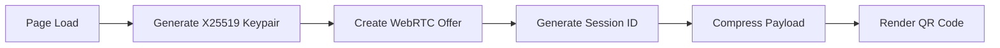
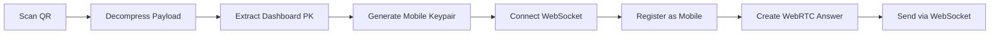
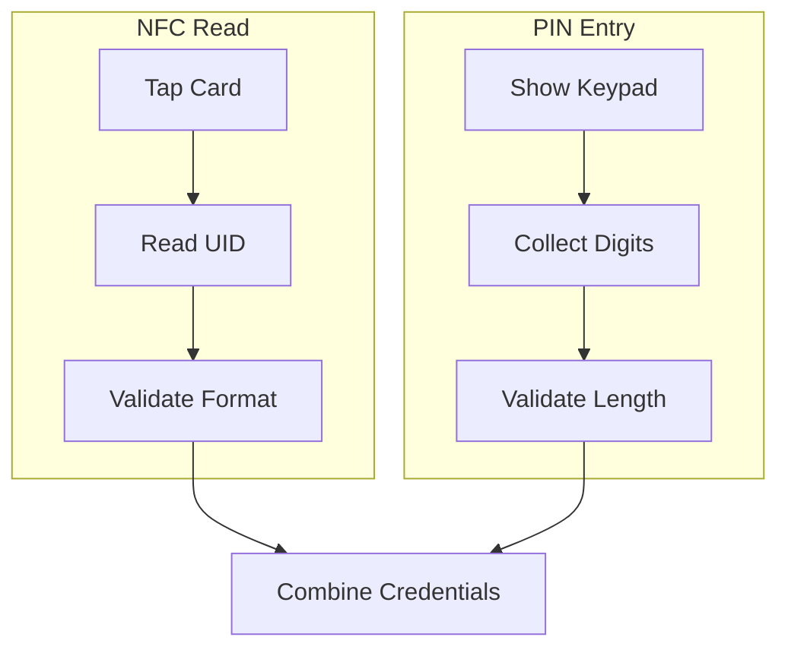
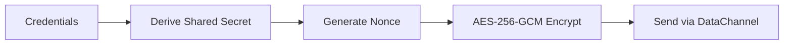
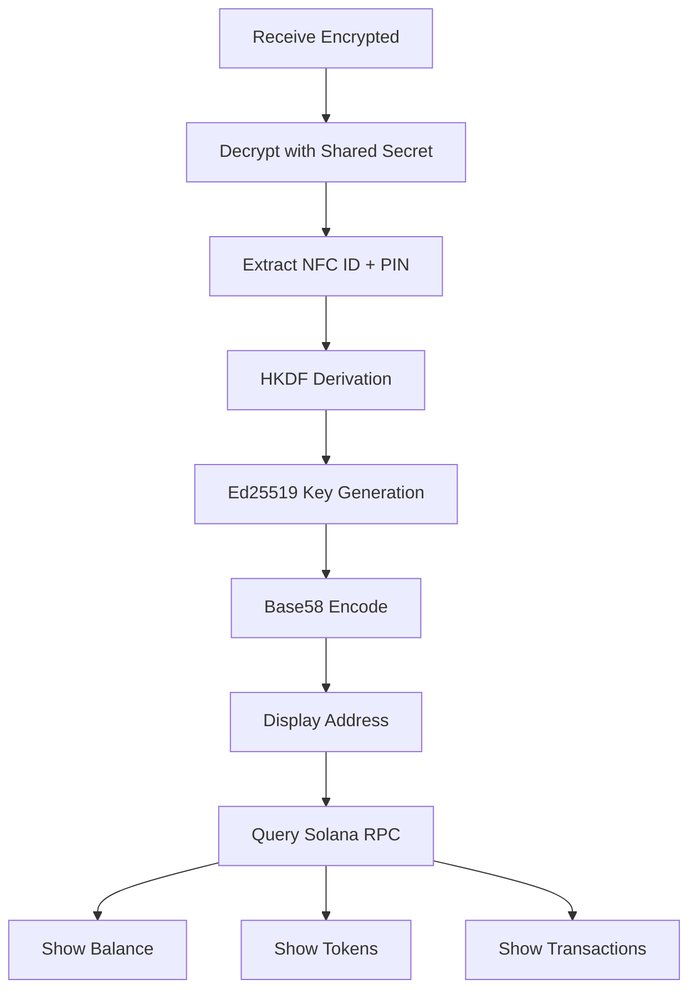

# Data Flow

This document traces the complete journey of credentials from NFC card tap to wallet display, highlighting security measures at each stage.

## Overview

The GRIPLOCK data flow consists of five phases:

1. **QR Generation** — Dashboard creates connection offer
2. **Mobile Connection** — App establishes secure channel
3. **Credential Collection** — NFC + PIN captured on mobile
4. **Secure Transmission** — Encrypted delivery to dashboard
5. **Wallet Derivation** — Address generation and display

## Phase 1: QR Code Generation

When the dashboard loads, it initiates the connection process:



### Generated Data Structure

```typescript
interface QRPayload {
  type: 'offer';
  sdp: string;           // WebRTC Session Description
  pk: string;            // Dashboard public key (hex)
  sessionId: string;     // Unique session identifier
  wsUrl: string;         // WebSocket signaling endpoint
}
```

The payload is compressed using pako (zlib) and base64-encoded for QR display:

```typescript
const compressed = pako.deflate(JSON.stringify(payload));
const qrData = btoa(String.fromCharCode(...compressed));
```

## Phase 2: Mobile Connection

The mobile app processes the QR code:



### WebSocket Registration

```typescript
// Mobile registers with the signaling server
ws.send(JSON.stringify({
  type: 'register_mobile',
  sessionId: extractedSessionId
}));
```

### WebRTC Answer

```typescript
interface AnswerPayload {
  type: 'answer';
  sdp: string;           // WebRTC answer SDP
  pk: string;            // Mobile public key (hex)
}
```

## Phase 3: Credential Collection

Once the P2P channel is established, the mobile app collects credentials:



### Credential Structure

```typescript
interface WalletCredentials {
  nfcId: string;    // NFC card UID (hex string)
  pin: string;      // User-entered PIN
}
```

<Warning>
  Credentials are held in memory only during transmission. They are never written to disk or persistent storage on the mobile device.
</Warning>

## Phase 4: Secure Transmission

Credentials are encrypted before transmission using the shared secret:



### Encryption Process

```typescript
// X25519 key exchange
const sharedPoint = x25519.getSharedSecret(mobilePrivateKey, dashboardPublicKey);

// HKDF key derivation
const sharedSecret = hkdf(sha256, sharedPoint, undefined, 'griplock/shared', 32);

// AES-GCM encryption
const nonce = randomBytes(12);
const aes = gcm(sharedSecret, nonce);
const ciphertext = aes.encrypt(JSON.stringify(credentials));

// Transmitted payload
const encrypted = {
  nonce: bytesToHex(nonce),
  ciphertext: bytesToHex(ciphertext)
};
```

### Security Properties

| Property | Guarantee |
|----------|-----------|
| **Confidentiality** | Only holder of corresponding private key can decrypt |
| **Integrity** | GCM mode provides authenticated encryption |
| **Forward Secrecy** | Ephemeral keys ensure past sessions cannot be decrypted |

## Phase 5: Wallet Derivation

The dashboard decrypts credentials and derives the wallet:



### Derivation Algorithm

```typescript
function deriveSolanaAddress(nfcId: string, pin: string): string {
  // Combine inputs
  const input = utf8ToBytes(nfcId + pin);
  
  // Domain-separated key derivation
  const salt = utf8ToBytes('griplock/solana/v1');
  const seed = hkdf(sha256, input, salt, 'griplock/ed25519-seed', 32);
  
  // Generate Ed25519 keypair
  const publicKey = ed25519.getPublicKey(seed);
  
  // Encode as Solana address
  const address = base58Encode(publicKey);
  
  // Zeroize sensitive data
  zeroize(input);
  zeroize(seed);
  
  return address;
}
```

## Data Lifecycle

```
┌─────────────────────────────────────────────────────────────┐
│                      MOBILE DEVICE                          │
├─────────────────────────────────────────────────────────────┤
│  NFC UID ──┐                                                │
│            ├──► In-Memory Only ──► Encrypt ──► Transmit     │
│  PIN ──────┘                                     │          │
│                                                  │          │
│  After transmission: Memory cleared              ▼          │
└─────────────────────────────────────────────────────────────┘
                                                   │
                        WebRTC DataChannel (Encrypted)
                                                   │
                                                   ▼
┌─────────────────────────────────────────────────────────────┐
│                      DASHBOARD                              │
├─────────────────────────────────────────────────────────────┤
│  Encrypted ──► Decrypt ──► Derive Address ──► Display       │
│                   │                              │          │
│                   ▼                              ▼          │
│          Store (Encrypted)              Query Blockchain    │
│                   │                                         │
│                   ▼                                         │
│          15-min TTL / Auto-clear                           │
└─────────────────────────────────────────────────────────────┘
```

## Error Handling

| Stage | Potential Errors | Handling |
|-------|------------------|----------|
| QR Generation | WebRTC not supported | Display browser compatibility warning |
| Mobile Connection | WebSocket failure | Retry with exponential backoff |
| NFC Read | Card not detected | Prompt to retry with positioning tips |
| Encryption | Key derivation failure | Clear state, restart connection |
| Transmission | DataChannel closed | Re-establish connection |
| Derivation | Invalid credentials | Display error, require re-authentication |

## Next Steps

<CardGroup cols={2}>
  <Card title="Components" icon="puzzle-piece" href="/architecture/components">
    Detailed component specifications
  </Card>
  <Card title="Key Derivation" icon="key" href="/security/key-derivation">
    Cryptographic derivation details
  </Card>
</CardGroup>
