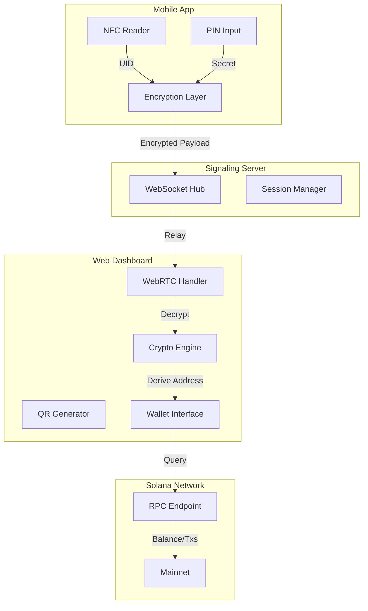
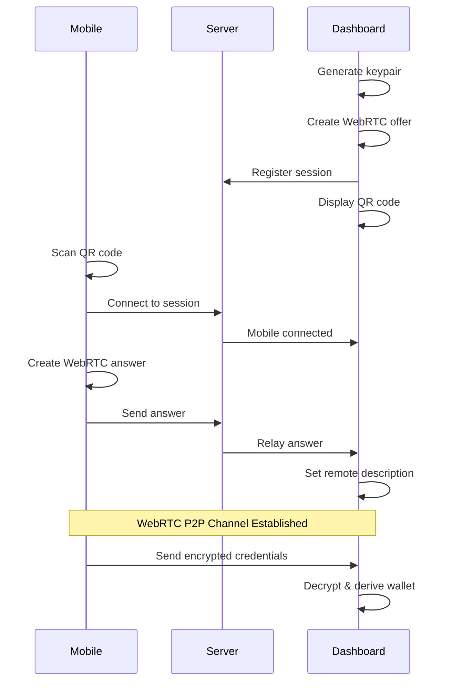

# System Overview

GRIPLOCK is architected as a distributed system with three primary components that work together to provide secure, ephemeral wallet access.

## Architecture Diagram



## Component Overview

<CardGroup cols={3}>
  <Card title="Mobile App" icon="mobile">
    Handles NFC card reading, PIN collection, and encrypted credential transmission
  </Card>
  <Card title="Signaling Server" icon="server">
    Facilitates WebRTC connection establishment and message relay during handshake
  </Card>
  <Card title="Web Dashboard" icon="display">
    Displays wallet information, manages sessions, and interacts with Solana blockchain
  </Card>
</CardGroup>

## Technology Stack

| Layer | Technology | Purpose |
|-------|------------|---------|
| **Frontend** | React 18 + TypeScript | Dashboard user interface |
| **Styling** | Tailwind CSS + Shadcn UI | Cyberpunk-themed design system |
| **Routing** | Wouter | Client-side navigation |
| **State** | TanStack Query + Context | Data fetching and state management |
| **Backend** | Express.js + TypeScript | WebSocket signaling server |
| **Real-time** | WebSocket + WebRTC | Bidirectional communication |
| **Cryptography** | Noble Curves + Noble Hashes | Ed25519, X25519, HKDF, AES-GCM |
| **Blockchain** | Solana JSON-RPC | Mainnet interaction |

## Design Principles

### 1. Zero-Knowledge Architecture

The server never has access to plaintext credentials. All sensitive data is encrypted end-to-end between the mobile app and dashboard using X25519 key exchange.

```
Mobile App ──[Encrypted]──► Server ──[Encrypted]──► Dashboard
                              │
                              └── Cannot decrypt, only relays
```

### 2. Ephemeral Derivation

Private keys are never stored—they're computed on-demand and immediately discarded after use:

```typescript
// Derivation happens in memory, result is used, then cleared
const seed = hkdf(sha256, nfcId + pin, salt, info, 32);
const publicKey = ed25519.getPublicKey(seed);
zeroize(seed); // Immediately cleared
```

### 3. Defense in Depth

Multiple security layers protect user assets:

<Steps>
  <Step title="Physical Layer">
    NFC card must be physically present—cannot be cloned or emulated
  </Step>
  <Step title="Knowledge Layer">
    PIN is required and never transmitted or stored
  </Step>
  <Step title="Transport Layer">
    All credentials encrypted with ephemeral X25519 keys
  </Step>
  <Step title="Session Layer">
    Time-limited access with activity-based expiration
  </Step>
  <Step title="Storage Layer">
    Browser storage encrypted with session-derived keys
  </Step>
</Steps>

## Communication Model

GRIPLOCK uses a hybrid communication model:

### WebSocket (Signaling Phase)
- Used for initial connection establishment
- Relays WebRTC offers/answers and ICE candidates
- Minimal data exposure—only encrypted payloads transit

### WebRTC (Data Phase)
- Peer-to-peer encrypted data channel
- Direct mobile-to-dashboard communication
- Server cannot observe data after connection established



## Scalability Considerations

| Aspect | Approach |
|--------|----------|
| **Session Management** | In-memory Map with cleanup on disconnect |
| **WebSocket Connections** | Stateless relay, minimal server memory |
| **Blockchain Queries** | Direct RPC calls, no caching layer |
| **Encryption** | Client-side only, no server computation |

## Next Steps

<CardGroup cols={2}>
  <Card title="Data Flow" icon="arrows-left-right" href="/architecture/data-flow">
    Detailed walkthrough of credential flow
  </Card>
  <Card title="Components" icon="puzzle-piece" href="/architecture/components">
    Deep dive into each system component
  </Card>
</CardGroup>
