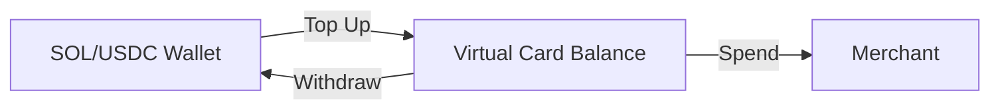

# Virtual Cards

GRIPLOCK lets you create virtual Visa cards instantly, funded directly from your wallet. Spend anywhere Visa is accepted—online shopping, subscriptions, global payments.

## Overview

<CardGroup cols={2}>
  <Card title="Instant Generation" icon="bolt">
    Create a new virtual card in seconds. No paperwork, no waiting.
  </Card>
  <Card title="Apple Pay & Google Pay" icon="mobile">
    Add your virtual card to your mobile wallet for contactless payments.
  </Card>
  <Card title="Fund with SOL/USDC" icon="coins">
    Top up your card balance directly from your crypto holdings.
  </Card>
  <Card title="Real-time Control" icon="sliders">
    Freeze, unfreeze, or cancel cards instantly from the dashboard.
  </Card>
</CardGroup>

## Creating a Card

<Steps>
  <Step title="Navigate to CARDS">
    Click **CARDS** in the navigation bar to access card management.
  </Step>
  <Step title="Generate New Card">
    Click **Create Card** and select your funding currency (SOL or USDC).
  </Step>
  <Step title="Set Initial Balance">
    Choose how much crypto to convert into card balance.
  </Step>
  <Step title="Card Ready">
    Your virtual card details appear instantly—card number, expiry, CVV.
  </Step>
</Steps>

## Card Features

### Mobile Wallet Integration

Add your GRIPLOCK virtual card to Apple Pay or Google Pay:

1. Open your card details in the dashboard
2. Tap **Add to Wallet**
3. Follow the prompts to add to Apple Pay or Google Pay
4. Use contactless payments anywhere

### Balance Management

| Action | Description |
|--------|-------------|
| **Top Up** | Convert crypto to card balance instantly |
| **Auto-Top Up** | Set minimum balance to trigger automatic funding |
| **Withdraw** | Move unused balance back to your wallet |

### Card Controls

<AccordionGroup>
  <Accordion title="Freeze Card">
    Instantly pause all transactions. Useful if you suspect unauthorized use.
  </Accordion>
  <Accordion title="Spending Limits">
    Set daily or per-transaction limits for additional security.
  </Accordion>
  <Accordion title="Cancel Card">
    Permanently deactivate a card. Remaining balance returns to your wallet.
  </Accordion>
  <Accordion title="Multiple Cards">
    Create separate cards for different purposes—subscriptions, shopping, travel.
  </Accordion>
</AccordionGroup>

## Supported Currencies

| Currency | Conversion | Notes |
|----------|------------|-------|
| **SOL** | Market rate | Real-time Solana price conversion |
| **USDC** | 1:1 | Stablecoin, no conversion volatility |

## Transaction History

All card transactions appear in your dashboard with:
- Merchant name and category
- Transaction amount in fiat and crypto equivalent
- Timestamp and status
- Card used for the transaction

## Security

<Info>
  Virtual card details are encrypted and only visible when you authenticate with your NFC card + PIN.
</Info>

- **Unique card per session**: Generate new cards as needed
- **No physical card to lose**: Everything is virtual
- **Instant freeze**: One tap to disable
- **Zero liability**: Fraudulent transactions are protected

## Next Steps

<CardGroup cols={2}>
  <Card title="Top Up with Moonpay" icon="circle-dollar-to-slot" href="/features/ramp">
    Need more crypto? Buy instantly with fiat
  </Card>
  <Card title="Privacy Settings" icon="shield" href="/features/privacy">
    Configure stealth mode and KYC preferences
  </Card>
</CardGroup>
