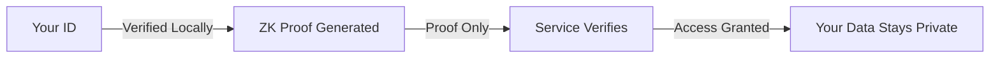

# Privacy & KYC

GRIPLOCK is built for privacy. Zero-knowledge proofs let you prove eligibility without revealing personal data. Stealth mode keeps your activity hidden.

## Privacy Philosophy

<CardGroup cols={2}>
  <Card title="Prove Without Revealing" icon="eye-slash">
    Zero-knowledge proofs verify facts without exposing underlying data.
  </Card>
  <Card title="No Cloud Storage" icon="cloud-arrow-down">
    Your credentials never leave your device. No servers store your identity.
  </Card>
  <Card title="Ephemeral Sessions" icon="clock">
    Session data auto-destructs. Nothing persists after logout.
  </Card>
  <Card title="Stealth Mode" icon="user-secret">
    Masked balances, hidden transactions, incognito operation.
  </Card>
</CardGroup>

## Zero-Knowledge KYC

Traditional KYC requires uploading ID documents to centralized servers. GRIPLOCK uses zero-knowledge proofs for privacy-preserving verification.

### How It Works



### What ZK-KYC Proves

| Claim | Revealed | Hidden |
|-------|----------|--------|
| Age > 18 | Yes | Birthdate |
| Country eligible | Yes | Address |
| Not sanctioned | Yes | Full name |
| Unique person | Yes | All PII |

### Supported Verification Types

<AccordionGroup>
  <Accordion title="Age Verification">
    Prove you're over 18/21 without revealing your actual birthdate.
  </Accordion>
  <Accordion title="Region Eligibility">
    Prove you're in a supported jurisdiction without revealing your address.
  </Accordion>
  <Accordion title="Sanctions Check">
    Prove you're not on sanctions lists without exposing personal details.
  </Accordion>
  <Accordion title="Unique Human">
    Prove you're a unique individual (anti-sybil) without biometric data.
  </Accordion>
</AccordionGroup>

## Stealth Mode

Enable stealth mode for maximum privacy:

### Dashboard Features

| Feature | Normal Mode | Stealth Mode |
|---------|-------------|--------------|
| Balance Display | Visible | Hidden (****) |
| Transaction List | Full details | Masked amounts |
| Address Display | Full | Truncated |
| Activity Logging | Standard | Minimal |

### Enabling Stealth Mode

<Steps>
  <Step title="Access PRIVACY Menu">
    Click **PRIVACY** in the navigation bar.
  </Step>
  <Step title="Toggle Stealth Mode">
    Enable the stealth mode switch.
  </Step>
  <Step title="Customize Settings">
    Choose which elements to mask—balances, addresses, transaction details.
  </Step>
  <Step title="Reveal on Demand">
    Tap "Show Balances" anytime to temporarily reveal data.
  </Step>
</Steps>

## Data Handling

### What GRIPLOCK Never Stores

- Seed phrases or private keys
- PIN codes
- Personal identity documents
- Transaction history on servers
- IP addresses or device fingerprints

### What Stays Local

- Encrypted session data (browser only)
- ZK proof attestations
- Spending limit preferences
- UI settings

### Filecoin Storage (Optional)

For users who want encrypted backups:

```typescript
// Backup is encrypted with your NFC+PIN derived key
{
  storage: "filecoin",
  encryption: "AES-256-GCM",
  access: "only you can decrypt"
}
```

- Encrypted preferences backup
- Decentralized, censorship-resistant
- Only accessible with your NFC card + PIN

## Privacy Settings

Access from the **PRIVACY** menu:

| Setting | Description |
|---------|-------------|
| **Stealth Mode** | Hide balances and mask transaction details |
| **Auto-Lock Timeout** | Session expires after inactivity (default: 15 min) |
| **ZK-KYC Status** | View and manage zero-knowledge proofs |
| **Data Export** | Download your local data (encrypted) |
| **Wipe Session** | Immediately clear all session data |

## Compliance Notes

<Info>
  Zero-knowledge KYC satisfies regulatory requirements while protecting your privacy. Services receive proof of compliance, not your personal data.
</Info>

- **Regulatory friendly**: ZK proofs are accepted for KYC/AML compliance
- **Reusable**: Verify once, reuse proofs across services
- **Revocable**: You control which proofs are active
- **Auditable**: Cryptographic proofs are verifiable

## Next Steps

<CardGroup cols={2}>
  <Card title="Security Deep Dive" icon="lock" href="/security/key-derivation">
    Understand the cryptographic foundations
  </Card>
  <Card title="Session Management" icon="clock" href="/security/session-management">
    Learn about secure session handling
  </Card>
</CardGroup>
