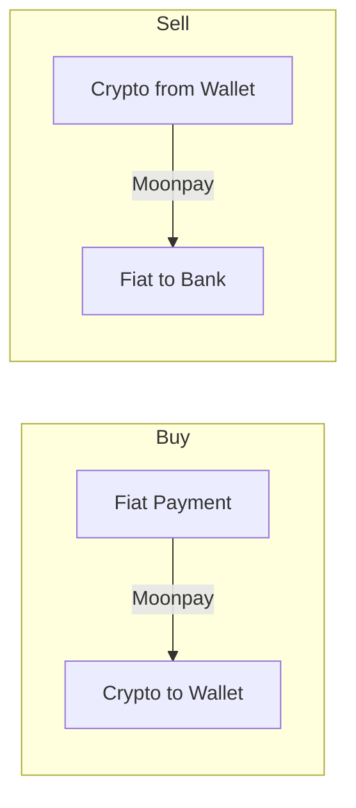

# Ramp: Buy & Sell Crypto

GRIPLOCK integrates Moonpay for seamless fiat-to-crypto (on-ramp) and crypto-to-fiat (off-ramp) conversions. Buy crypto with your credit card and cash out directly to your bank.

## Overview

<CardGroup cols={2}>
  <Card title="Buy Crypto" icon="circle-dollar-to-slot">
    Purchase SOL, USDC, and other tokens with fiat currency.
  </Card>
  <Card title="Cash Out" icon="money-bill-transfer">
    Sell crypto and receive fiat directly to your bank account.
  </Card>
  <Card title="Global Coverage" icon="globe">
    Available in 160+ countries with local payment methods.
  </Card>
  <Card title="Fast Processing" icon="bolt">
    Card purchases complete in minutes. Bank transfers within 1-3 days.
  </Card>
</CardGroup>

## Buying Crypto (On-Ramp)

### Supported Payment Methods

| Method | Speed | Fees | Limits |
|--------|-------|------|--------|
| **Credit/Debit Card** | Instant | 3.5% | Up to $10,000/day |
| **Apple Pay** | Instant | 3.5% | Up to $10,000/day |
| **Google Pay** | Instant | 3.5% | Up to $10,000/day |
| **Bank Transfer** | 1-3 days | 1% | Up to $50,000/month |
| **PIX (Brazil)** | Instant | 2% | Varies |

### How to Buy

<Steps>
  <Step title="Navigate to RAMP">
    Click **RAMP** in the navigation bar, then select **Buy**.
  </Step>
  <Step title="Choose Amount">
    Enter the amount in fiat (USD, EUR, etc.) or crypto (SOL, USDC).
  </Step>
  <Step title="Select Payment Method">
    Choose your preferred payment option—card, Apple Pay, bank transfer.
  </Step>
  <Step title="Complete Verification">
    First-time users complete a quick KYC verification (usually under 2 minutes).
  </Step>
  <Step title="Confirm Purchase">
    Review the transaction details and confirm. Crypto arrives in your wallet.
  </Step>
</Steps>

## Selling Crypto (Off-Ramp)

### Supported Payout Methods

| Method | Speed | Fees | Minimum |
|--------|-------|------|---------|
| **Bank Transfer (ACH)** | 1-3 days | 1% | $20 |
| **Bank Transfer (SEPA)** | 1-2 days | 1% | €20 |
| **Debit Card** | Instant | 2.5% | $50 |

### How to Sell

<Steps>
  <Step title="Navigate to RAMP">
    Click **RAMP** in the navigation bar, then select **Sell**.
  </Step>
  <Step title="Choose Crypto">
    Select which token to sell (SOL, USDC, etc.) and enter the amount.
  </Step>
  <Step title="Select Payout">
    Choose where to receive your fiat—bank account or debit card.
  </Step>
  <Step title="Confirm Sale">
    Review the exchange rate and fees, then confirm the transaction.
  </Step>
  <Step title="Receive Funds">
    Fiat is deposited to your account within the stated timeframe.
  </Step>
</Steps>

## Supported Cryptocurrencies

| Token | Buy | Sell | Network |
|-------|-----|------|---------|
| **SOL** | Yes | Yes | Solana |
| **USDC** | Yes | Yes | Solana |
| **USDT** | Yes | Yes | Solana |
| **ETH** | Yes | Yes | Ethereum |
| **BTC** | Yes | Yes | Bitcoin |

## KYC Verification

Moonpay requires identity verification for regulatory compliance:

<AccordionGroup>
  <Accordion title="Basic Verification">
    - Email and phone verification
    - Limits: Up to $750/month
    - Time: Instant
  </Accordion>
  <Accordion title="Full Verification">
    - Government ID + selfie
    - Limits: Up to $50,000/month
    - Time: Usually under 5 minutes
  </Accordion>
  <Accordion title="Privacy Note">
    GRIPLOCK uses Moonpay's built-in KYC. Your verification data is stored by Moonpay, not GRIPLOCK. See our Privacy page for zero-knowledge alternatives.
  </Accordion>
</AccordionGroup>

## Transaction Flow

## Fees Summary

| Transaction | Moonpay Fee | Network Fee |
|-------------|-------------|-------------|
| Buy with Card | 3.5% | Included |
| Buy with Bank | 1% | Included |
| Sell to Bank | 1% | Solana gas (~$0.001) |
| Sell to Card | 2.5% | Solana gas (~$0.001) |

## Next Steps

<CardGroup cols={2}>
  <Card title="Virtual Cards" icon="credit-card" href="/features/cards">
    Spend your crypto with virtual Visa cards
  </Card>
  <Card title="Swap Tokens" icon="arrows-rotate" href="/features/x402">
    Exchange tokens via DEX aggregators
  </Card>
</CardGroup>
