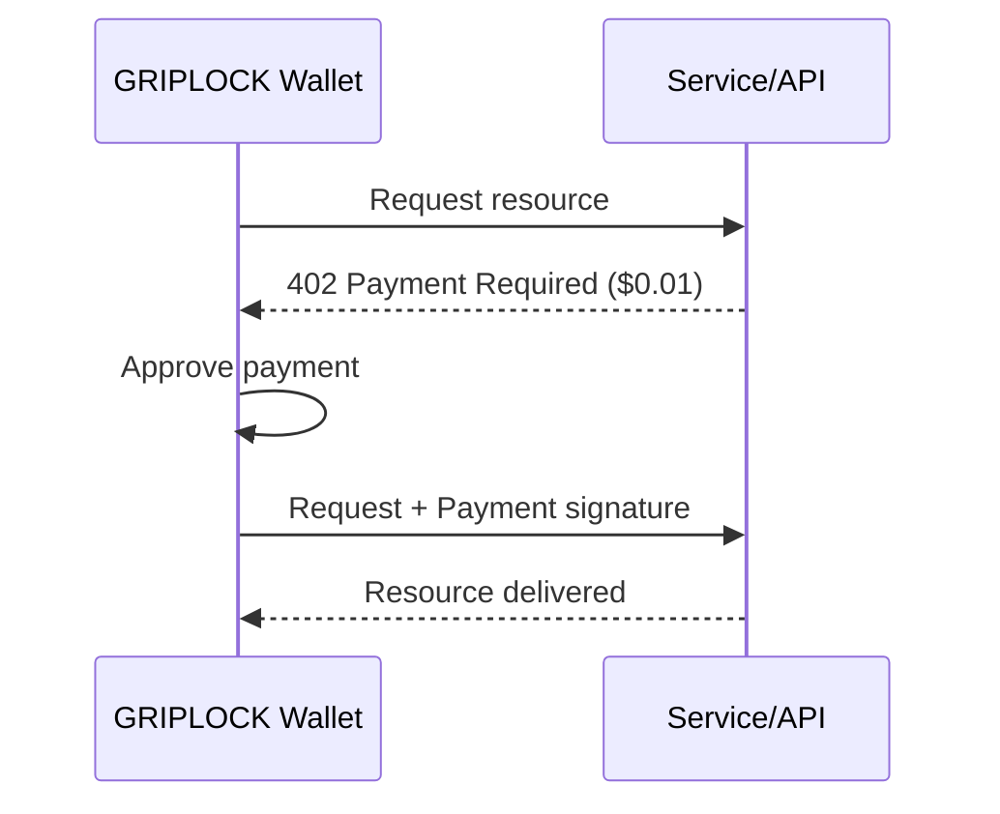

# Micropayments with x402 Protocol

GRIPLOCK integrates the x402 protocol—an open standard for internet-native payments. Pay for APIs, AI services, and content with micropayments as small as $0.001.

## What is x402?

x402 uses the HTTP 402 "Payment Required" status code to enable machine-to-machine payments. When a service requires payment, it responds with payment details. Your wallet automatically handles the transaction.



## Why Micropayments?

<CardGroup cols={2}>
  <Card title="Pay-Per-Use" icon="gauge">
    Only pay for what you actually use. No subscriptions, no minimums.
  </Card>
  <Card title="AI Agent Ready" icon="robot">
    Autonomous agents can transact without human approval for small amounts.
  </Card>
  <Card title="Near-Zero Fees" icon="coins">
    Solana's low fees make micropayments economically viable.
  </Card>
  <Card title="Instant Settlement" icon="bolt">
    Transactions settle in seconds, not days.
  </Card>
</CardGroup>

## Use Cases

### API Access

Pay per API call instead of monthly subscriptions:

| Service Type | Typical Cost | Example |
|--------------|--------------|---------|
| LLM Tokens | $0.001/1K tokens | ChatGPT, Claude APIs |
| Data Queries | $0.01/query | Market data, analytics |
| Compute | $0.001/second | Serverless functions |
| Storage | $0.001/MB | File hosting |

### AI Agents

Configure spending limits for autonomous agents:

```typescript
// Agent spending configuration
{
  "maxPerTransaction": "0.10",  // Max $0.10 per transaction
  "dailyLimit": "5.00",         // Max $5 per day
  "approvedDomains": [          // Only pay these services
    "api.openai.com",
    "api.anthropic.com"
  ]
}
```

### Content Access

Unlock articles, videos, and media with micropayments:

- Pay $0.05 to read an article (no subscription needed)
- Pay $0.10 for a song or video
- Pay $0.25 for premium features

## Dashboard Features

### MICROPAY Menu

Access micropayment controls from the navigation bar:

| Feature | Description |
|---------|-------------|
| **Transaction History** | View all x402 payments with details |
| **Spending Limits** | Configure daily/per-transaction limits |
| **Auto-Pay Settings** | Set thresholds for automatic approval |
| **Approved Services** | Whitelist domains for seamless payments |

### Auto-Approve Thresholds

Set amounts that auto-approve without confirmation:

<AccordionGroup>
  <Accordion title="Instant Approve (< $0.05)">
    Transactions under $0.05 approve automatically. Ideal for API calls.
  </Accordion>
  <Accordion title="Quick Confirm ($0.05 - $1.00)">
    Single tap to confirm. No PIN required.
  </Accordion>
  <Accordion title="Full Auth (> $1.00)">
    Requires NFC card + PIN verification for security.
  </Accordion>
</AccordionGroup>

## Technical Integration

### For Developers

GRIPLOCK wallets support x402 natively. Services can request payment:

```typescript
// Service responds with 402
HTTP/1.1 402 Payment Required
X-Payment-Amount: 0.01
X-Payment-Currency: USDC
X-Payment-Address: YOUR_SOLANA_ADDRESS
X-Payment-Network: solana

// GRIPLOCK wallet handles payment automatically
// Then resends request with payment proof
```

### Supported Networks

| Network | Currency | Status |
|---------|----------|--------|
| **Solana** | USDC | Active |
| **Base** | USDC | Active |
| **Ethereum** | USDC | Coming Soon |

## Privacy & Control

<Info>
  Micropayments are made from your ephemeral wallet. Transaction history is only visible when authenticated with NFC + PIN.
</Info>

- **Spending limits**: Cap daily and per-transaction amounts
- **Domain whitelists**: Only pay approved services
- **Transaction logs**: Full visibility into all payments
- **Instant disable**: Turn off auto-pay anytime

## Next Steps

<CardGroup cols={2}>
  <Card title="Privacy & KYC" icon="shield" href="/features/privacy">
    Configure zero-knowledge verification
  </Card>
  <Card title="Virtual Cards" icon="credit-card" href="/features/cards">
    Spend crypto at traditional merchants
  </Card>
</CardGroup>
