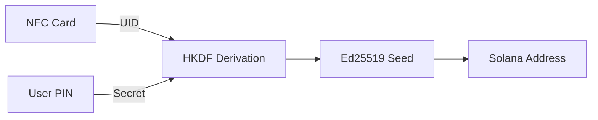

# What is GRIPLOCK?

GRIPLOCK is a next-generation cryptocurrency wallet system that combines **NFC hardware security** with **ephemeral key generation** to deliver uncompromising protection for your digital assets.

<CardGroup cols={2}>
  <Card title="Zero Private Key Storage" icon="shield-halved">
    Private keys are never stored—they're deterministically derived on-demand from your NFC card and PIN combination.
  </Card>
  <Card title="Hardware-Grade Security" icon="microchip">
    Leverages physical NFC cards as unforgeable hardware tokens that must be physically present to access funds.
  </Card>
  <Card title="Session-Based Access" icon="clock">
    Time-limited sessions with activity-based expiration ensure your wallet auto-locks after inactivity.
  </Card>
  <Card title="End-to-End Encryption" icon="lock">
    All credential transmission uses X25519 key exchange with AES-256-GCM encryption.
  </Card>
</CardGroup>

## How It Works

GRIPLOCK implements a unique **two-factor derivation model** where your Solana wallet address is deterministically computed from:

1. **NFC Card UID** — A unique, immutable hardware identifier embedded in your NFC card
2. **User PIN** — A secret numeric code known only to you

Neither factor alone can derive the wallet. Both must be present simultaneously, creating true two-factor authentication at the cryptographic level.

## The GRIPLOCK Difference

Traditional hardware wallets store private keys on the device, creating a single point of failure. GRIPLOCK takes a fundamentally different approach:

| Traditional Wallets | GRIPLOCK |
|---------------------|----------|
| Private key stored on device | No private key storage anywhere |
| Device theft = funds at risk | Card theft alone is useless |
| Recovery phrases can be stolen | Nothing to steal—derivation is ephemeral |
| Complex backup procedures | Just remember your PIN |

## Key Features

<AccordionGroup>
  <Accordion title="Deterministic Key Derivation">
    Using HKDF-SHA256 with domain separation, GRIPLOCK derives the same Ed25519 keypair every time from identical inputs. No seed storage required.
  </Accordion>
  <Accordion title="WebRTC Secure Channel">
    Mobile-to-dashboard communication uses WebRTC data channels with X25519 ECDH key exchange, ensuring credentials never transit through servers in plaintext.
  </Accordion>
  <Accordion title="Activity-Based Session Timeout">
    Sessions automatically expire after 15 minutes of inactivity. Any user interaction (mouse movement, clicks, keyboard input) resets the timer.
  </Accordion>
  <Accordion title="Real-Time Blockchain Data">
    Direct integration with Solana mainnet RPC for live balance, SPL token holdings, and transaction history.
  </Accordion>
</AccordionGroup>

## Target Use Cases

- **High-Security Wallets** — For users who need maximum protection without complex hardware wallet setups
- **Cold Storage Access** — Ephemeral access to cold storage funds when needed
- **Institutional Access Control** — Multi-party access requiring physical NFC card presence
- **Point-of-Sale Systems** — NFC tap-to-pay scenarios where wallet access is momentary

## Next Steps

<CardGroup cols={2}>
  <Card title="Quickstart" icon="rocket" href="/quickstart">
    Get up and running with GRIPLOCK in minutes
  </Card>
  <Card title="Architecture" icon="sitemap" href="/architecture/overview">
    Deep dive into system design and components
  </Card>
  <Card title="Security" icon="shield" href="/security/key-derivation">
    Understand the cryptographic foundations
  </Card>
  <Card title="API Reference" icon="code" href="/api-reference/overview">
    Integrate GRIPLOCK into your applications
  </Card>
</CardGroup>
