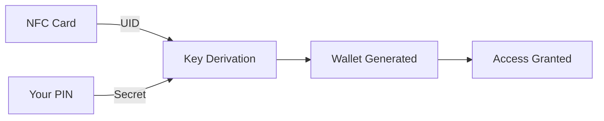

# What is GRIPLOCK?

**The stealth digital asset manager that uses your existing NFC cards as a physical verification layer.**

Crypto security relies on software. Software can be exploited, seed phrases exposed, and access silently taken. GRIPLOCK adds a physical verification layer that turns the card you already carry into a lock for your digital assets.

**Without a tap, nothing moves.**

<CardGroup cols={2}>
  <Card title="No Private Key Storage" icon="shield-halved">
    Private keys are never stored anywhere. They're derived on-demand from your NFC card + PIN combination.
  </Card>
  <Card title="Physical Verification" icon="id-card">
    Your NFC card becomes an unforgeable hardware token. No card present = no access.
  </Card>
  <Card title="Auto-Lock Sessions" icon="clock">
    15-minute activity-based timeout. Your wallet locks itself after inactivity.
  </Card>
  <Card title="End-to-End Encrypted" icon="lock">
    X25519 key exchange + AES-256-GCM encryption. Credentials never touch servers.
  </Card>
</CardGroup>

## Your Card. Your Vault.

GRIPLOCK implements a **two-factor derivation model** where your Solana wallet is computed from:

1. **NFC Card UID** — The unique hardware identifier in your card
2. **Your PIN** — A secret code only you know

Neither factor alone can access the wallet. Both must be present simultaneously.

## The GRIPLOCK Difference

Traditional wallets store private keys, creating a single point of failure. GRIPLOCK takes a fundamentally different approach:

| Traditional Wallets | GRIPLOCK |
|---------------------|----------|
| Private key stored on device | No key storage anywhere |
| Device theft = funds at risk | Card theft alone is useless |
| Seed phrases can be stolen | Nothing to steal |
| Complex backup procedures | Just remember your PIN |

## How It Works

<AccordionGroup>
  <Accordion title="Tap Your Card">
    Open the GRIPLOCK mobile app and tap any NFC card. The app reads the card's unique hardware identifier.
  </Accordion>
  <Accordion title="Enter Your PIN">
    Input your secret PIN. The combination of card UID + PIN derives your wallet cryptographically.
  </Accordion>
  <Accordion title="Access Your Wallet">
    Your Solana wallet appears on the dashboard with real balances, tokens, and transaction history.
  </Accordion>
  <Accordion title="Session Auto-Locks">
    After 15 minutes of inactivity, your session expires. Tap again to re-access.
  </Accordion>
</AccordionGroup>

## Use Cases

- **High-Security Storage** — Maximum protection without complex hardware wallets
- **Cold Storage Access** — Ephemeral access to cold funds when needed
- **Team Access Control** — Physical card presence required for transactions
- **Point-of-Sale** — Tap-to-access for momentary wallet authorization

## Get Started

<CardGroup cols={2}>
  <Card title="Quickstart" icon="rocket" href="/quickstart">
    Get up and running in minutes
  </Card>
  <Card title="Architecture" icon="sitemap" href="/architecture/overview">
    Deep dive into system design
  </Card>
  <Card title="Security" icon="shield" href="/security/key-derivation">
    Understand the cryptographic foundations
  </Card>
  <Card title="API Reference" icon="code" href="/api-reference/overview">
    Integrate GRIPLOCK into your apps
  </Card>
</CardGroup>
