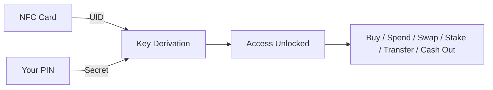

# What is GRIPLOCK?

**The stealth key to your DeFi access.**

GRIPLOCK is your secure gateway to the decentralized finance ecosystem. One NFC card that unlocks everything. Protected by physical verification that only you control.

<CardGroup cols={3}>
  <Card title="Virtual Visa Cards" icon="credit-card">
    Generate instant virtual cards funded by SOL. Spend anywhere via Apple Pay and Google Pay.
  </Card>
  <Card title="Instant Swaps" icon="arrows-rotate">
    Swap tokens instantly through integrated DEX aggregators. Best rates, zero friction.
  </Card>
  <Card title="Global Transfers" icon="globe">
    Send crypto with fast, low-fee transfers on Solana. Borderless payments in seconds.
  </Card>
  <Card title="SOL Staking" icon="seedling">
    Stake SOL and earn auto-compound yields. Your assets work while you sleep.
  </Card>
  <Card title="Buy Crypto" icon="circle-dollar-to-slot">
    On-ramp fiat to crypto instantly via Moonpay. Credit cards, Apple Pay, bank transfers.
  </Card>
  <Card title="Cash Out" icon="money-bill-transfer">
    Off-ramp crypto to fiat directly to your bank. No exchange needed.
  </Card>
</CardGroup>

## Security Reimagined

Crypto wallets have always relied on software. But software can be hacked, seed phrases exposed, and access stolen without a trace.

**GRIPLOCK changes everything by adding a physical security layer.**

<AccordionGroup>
  <Accordion title="No Seed Phrases">
    Nothing to write down. Nothing to lose. Nothing to steal.
  </Accordion>
  <Accordion title="Ephemeral Wallets">
    Fresh keys generated on demand. Vanish when you're done. No persistent attack surface.
  </Accordion>
  <Accordion title="Zero Knowledge Authentication">
    Prove ownership without exposing credentials. Privacy-preserving verification.
  </Accordion>
  <Accordion title="Auto-Lock Sessions">
    15-minute activity timeout. Masked balances. Your financial data stays yours.
  </Accordion>
</AccordionGroup>

## Two Factors. Total Control.

Your NFC card becomes the ultimate lock. Combined with your PIN, they unlock everything.

| Without Card | Without PIN | With Both |
|--------------|-------------|-----------|
| No access | No access | Full access |
| Nothing moves | Nothing moves | Everything unlocked |

## Features

GRIPLOCK isn't just security. It's full-cycle DeFi access.

<CardGroup cols={3}>
  <Card title="Buy Crypto" icon="circle-dollar-to-slot">
    On-ramp from fiat via Moonpay. Cards, Apple Pay, bank transfers. 160+ countries.
  </Card>
  <Card title="Spend Anywhere" icon="cart-shopping">
    Virtual Visa cards work everywhere Visa is accepted. Online shopping, subscriptions, global payments.
  </Card>
  <Card title="Swap Tokens" icon="right-left">
    Integrated DEX aggregators find the best rates. Swap any Solana token instantly.
  </Card>
  <Card title="Earn Yields" icon="chart-line">
    Stake SOL with auto-compound. Maximize returns without manual intervention.
  </Card>
  <Card title="Micropayments" icon="bolt">
    x402 protocol enables pay-per-use APIs and AI agent payments. Internet-native transactions.
  </Card>
  <Card title="Cash Out" icon="money-bill-transfer">
    Off-ramp crypto to fiat via Moonpay. Direct to bank. No exchange needed.
  </Card>
</CardGroup>

## Built for Privacy

<Steps>
  <Step title="Zero Cloud Connection">
    No tracking. No analytics. No data collection. Your activity stays on your device.
  </Step>
  <Step title="Privacy-Preserving KYC">
    Zero knowledge proofs let you prove eligibility without revealing personal data.
  </Step>
  <Step title="Stealth Operation">
    Dashboard and mobile app designed for discretion. Masked balances. Hidden activity.
  </Step>
</Steps>

## Tech Stack

Built on cutting-edge decentralized infrastructure:

| Layer | Technology |
|-------|------------|
| **Blockchain** | Solana — fast, low-fee transactions |
| **On/Off-Ramp** | Moonpay — fiat to crypto and back |
| **Payments** | x402 Protocol — HTTP-native micropayments |
| **Privacy** | Zero Knowledge proofs — prove without revealing |
| **Storage** | Filecoin — decentralized, censorship-resistant |
| **Security** | NFC + PIN derivation — hardware-grade protection |

## Get Started

<CardGroup cols={2}>
  <Card title="Quickstart" icon="rocket" href="/quickstart">
    Get up and running in minutes
  </Card>
  <Card title="Architecture" icon="sitemap" href="/architecture/overview">
    Deep dive into system design
  </Card>
  <Card title="Security" icon="shield" href="/security/key-derivation">
    Understand the cryptographic foundations
  </Card>
  <Card title="API Reference" icon="code" href="/api-reference/overview">
    Integrate GRIPLOCK into your apps
  </Card>
</CardGroup>
