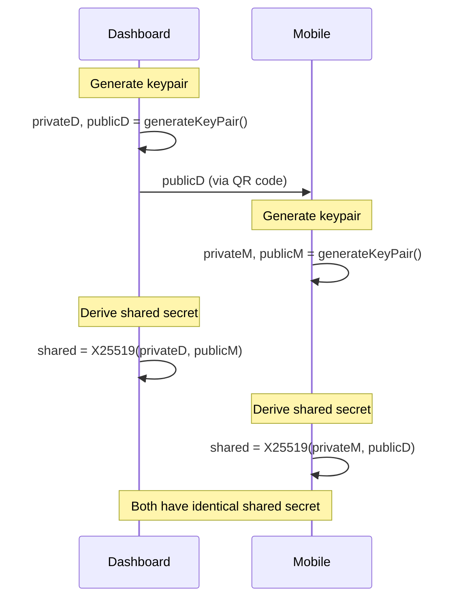

# Encryption

GRIPLOCK implements end-to-end encryption for all credential transmission between the mobile app and dashboard. This document details the cryptographic protocols used.

## Encryption Stack

| Layer | Algorithm | Key Size | Purpose |
|-------|-----------|----------|---------|
| Key Exchange | X25519 | 256-bit | Establish shared secret |
| Key Derivation | HKDF-SHA256 | 256-bit | Derive symmetric key |
| Symmetric Encryption | AES-256-GCM | 256-bit | Encrypt credentials |

## Key Exchange Protocol

### Overview

GRIPLOCK uses X25519 Elliptic Curve Diffie-Hellman (ECDH) for key agreement:



### Implementation

```typescript
// Dashboard generates keypair
const dashboardKeyPair = generateKeyPair();
// { publicKey: Uint8Array, privateKey: Uint8Array }

// Public key included in QR code
const qrPayload = {
  pk: publicKeyToHex(dashboardKeyPair.publicKey),
  // ... other fields
};

// Mobile extracts dashboard public key and generates own keypair
const mobileKeyPair = generateKeyPair();
const dashboardPublicKey = hexToPublicKey(qrPayload.pk);

// Both sides derive the same shared secret
const sharedSecret = deriveSharedSecret(
  mobileKeyPair.privateKey,
  dashboardPublicKey
);
```

### Shared Secret Derivation

Raw X25519 output is passed through HKDF for additional security:

```typescript
export function deriveSharedSecret(
  privateKey: Uint8Array, 
  peerPublicKey: Uint8Array
): Uint8Array {
  // X25519 key agreement
  const sharedPoint = x25519.getSharedSecret(privateKey, peerPublicKey);
  
  // HKDF to derive final key
  return hkdf(
    sha256, 
    sharedPoint, 
    undefined,                    // No salt
    utf8ToBytes('griplock/shared'), // Context info
    32                            // 256-bit key
  );
}
```

This provides:
- Key stretching
- Domain separation
- Additional entropy mixing

## Symmetric Encryption

### AES-256-GCM

Credentials are encrypted using AES-256 in Galois/Counter Mode:

```typescript
export function encryptPayload(
  data: DecryptedWalletData,
  sharedSecret: Uint8Array
): { nonce: string; ciphertext: string } {
  // Generate random 12-byte nonce
  const nonce = randomBytes(12);
  
  // Serialize data
  const plaintext = utf8ToBytes(JSON.stringify(data));
  
  // AES-256-GCM encryption
  const aes = gcm(sharedSecret, nonce);
  const ciphertext = aes.encrypt(plaintext);
  
  return {
    nonce: bytesToHex(nonce),
    ciphertext: bytesToHex(ciphertext),
  };
}
```

### Properties

| Property | Guarantee |
|----------|-----------|
| **Confidentiality** | Only parties with shared secret can decrypt |
| **Integrity** | GCM authentication tag detects tampering |
| **Authenticity** | Ciphertext is authenticated to the encryption key |

### Decryption

```typescript
export function decryptPayload(
  encrypted: { nonce: string; ciphertext: string },
  sharedSecret: Uint8Array
): DecryptedWalletData {
  const nonce = hexToBytes(encrypted.nonce);
  const ciphertext = hexToBytes(encrypted.ciphertext);
  
  const aes = gcm(sharedSecret, nonce);
  const plaintext = aes.decrypt(ciphertext);
  
  const data = JSON.parse(bytesToUtf8(plaintext));
  
  // Zeroize sensitive data
  zeroize(plaintext);
  
  return data as DecryptedWalletData;
}
```

## Encrypted Payload Format

### Transmission Format

```typescript
interface EncryptedCredentials {
  type: 'encrypted_credentials';
  nonce: string;      // 24 hex chars (12 bytes)
  ciphertext: string; // Variable length hex
}
```

### Example

```json
{
  "type": "encrypted_credentials",
  "nonce": "a1b2c3d4e5f6a1b2c3d4e5f6",
  "ciphertext": "8f9e7d6c5b4a39281..."
}
```

## Session Storage Encryption

Credentials persisted in browser storage are also encrypted:

```typescript
export function encryptForStorage(
  data: { nfcId: string; pin: string; sessionId: string },
  sessionId: string,
  ttlMinutes: number = 15
): EncryptedStorageData {
  const expiresAt = Date.now() + (ttlMinutes * 60 * 1000);
  
  // Derive storage-specific key from session ID
  const storageKey = deriveStorageKey(sessionId);
  
  const nonce = randomBytes(12);
  
  const payload: StoredWalletData = {
    ...data,
    expiresAt,
  };
  
  const plaintext = utf8ToBytes(JSON.stringify(payload));
  const aes = gcm(storageKey, nonce);
  const ciphertext = aes.encrypt(plaintext);
  
  // Zeroize sensitive data
  zeroize(storageKey);
  zeroize(plaintext);
  
  return {
    nonce: bytesToHex(nonce),
    ciphertext: bytesToHex(ciphertext),
    expiresAt,
  };
}
```

### Storage Key Derivation

```typescript
function deriveStorageKey(sessionId: string): Uint8Array {
  const salt = utf8ToBytes('griplock/storage/v1');
  const input = utf8ToBytes(sessionId);
  return hkdf(sha256, input, salt, utf8ToBytes('griplock/storage-key'), 32);
}
```

This ensures:
- Storage encryption key is derived from session ID
- Session ID must be known to decrypt storage
- Different sessions use different encryption keys

## Security Guarantees

### Forward Secrecy

Each session generates new ephemeral keypairs:

```
Session 1: (privD1, pubD1), (privM1, pubM1) → shared1
Session 2: (privD2, pubD2), (privM2, pubM2) → shared2
```

Compromise of one session's keys doesn't affect others.

### Zero Server Knowledge

The signaling server only sees encrypted payloads:

```
Mobile ──[encrypted]──► Server ──[encrypted]──► Dashboard
             │
             └── Cannot decrypt without shared secret
```

### Memory Zeroization

All sensitive data is cleared immediately after use:

```typescript
const seed = deriveKey(...);
// Use seed
zeroize(seed); // Fill with zeros
```

## Attack Resistance

<AccordionGroup>
  <Accordion title="Man-in-the-Middle">
    The QR code contains the dashboard's public key. An attacker would need to intercept the QR display (physical access) to substitute their own key.
  </Accordion>
  <Accordion title="Replay Attack">
    Fresh nonces for each encryption and session-specific keys prevent replaying old encrypted payloads.
  </Accordion>
  <Accordion title="Chosen Ciphertext">
    AES-GCM's authentication tag rejects any modified ciphertext, preventing CCA attacks.
  </Accordion>
  <Accordion title="Timing Attack">
    Noble cryptography libraries use constant-time comparison and operations.
  </Accordion>
</AccordionGroup>

## Cryptographic Library

GRIPLOCK uses the Noble suite of cryptographic libraries:

```typescript
import { x25519, ed25519 } from '@noble/curves/ed25519';
import { hkdf } from '@noble/hashes/hkdf';
import { sha256 } from '@noble/hashes/sha2';
import { gcm } from '@noble/ciphers/aes';
```

### Why Noble?

- ✅ Audited by Cure53
- ✅ No native dependencies
- ✅ Constant-time implementations
- ✅ Modern, well-maintained
- ✅ TypeScript support

## Next Steps

<CardGroup cols={2}>
  <Card title="Session Management" icon="clock" href="/security/session-management">
    Session lifecycle and timeout
  </Card>
  <Card title="API Reference" icon="code" href="/api-reference/overview">
    WebSocket and payload formats
  </Card>
</CardGroup>
