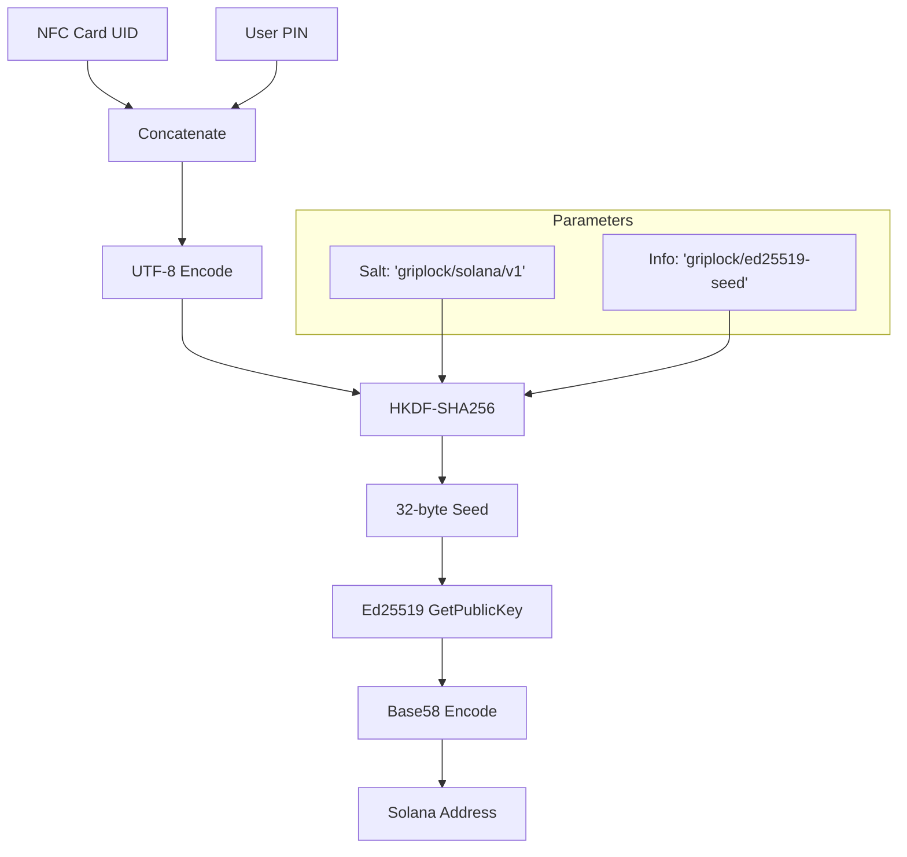

# Key Derivation

GRIPLOCK uses a deterministic key derivation scheme to generate Solana wallet addresses from two input factors: the NFC card UID and the user's PIN.

## Overview

The derivation process transforms two secrets into a valid Ed25519 keypair, which is then encoded as a Solana address. This process is:

- **Deterministic** — Same inputs always produce the same address
- **Irreversible** — Cannot recover inputs from the address
- **Domain-separated** — Isolated from other derivation contexts

## Derivation Pipeline



## Implementation Details

### Step 1: Input Preparation

```typescript
const input = utf8ToBytes(nfcId + pin);
```

The NFC UID and PIN are concatenated and converted to a byte array. This simple concatenation is safe because:

- NFC UIDs have fixed, known formats (typically 4, 7, or 10 bytes hex)
- The HKDF process provides collision resistance regardless of input structure

### Step 2: Salt Generation

```typescript
const salt = utf8ToBytes('griplock/solana/v1');
```

A fixed, domain-specific salt ensures:
- Derivations are isolated to the GRIPLOCK context
- Different versions can use different salts for migration
- Prevents rainbow table attacks across applications

### Step 3: HKDF Key Derivation

```typescript
const seed = hkdf(sha256, input, salt, utf8ToBytes('griplock/ed25519-seed'), 32);
```

HKDF (HMAC-based Key Derivation Function) is used with:

| Parameter | Value | Purpose |
|-----------|-------|---------|
| Hash | SHA-256 | Cryptographic hash function |
| IKM | `nfcId + pin` | Input keying material |
| Salt | `griplock/solana/v1` | Domain separation |
| Info | `griplock/ed25519-seed` | Context binding |
| Length | 32 bytes | Ed25519 seed size |

### Step 4: Ed25519 Key Generation

```typescript
const publicKey = ed25519.getPublicKey(seed);
```

The 32-byte seed is used directly as an Ed25519 private key scalar. The corresponding public key is derived using the Ed25519 curve multiplication.

<Info>
  **Note:** The seed IS the private key. It's used once for derivation and immediately zeroized. The private key is never stored or transmitted.
</Info>

### Step 5: Base58 Encoding

```typescript
const address = base58Encode(publicKey);
```

The 32-byte Ed25519 public key is encoded using Base58 (the Bitcoin/Solana alphabet) to produce the final address string.

## Complete Implementation

```typescript
export function deriveSolanaAddress(nfcId: string, pin: string): string {
  // Step 1: Prepare input
  const input = utf8ToBytes(nfcId + pin);
  
  // Step 2: Domain-specific salt
  const salt = utf8ToBytes('griplock/solana/v1');
  
  // Step 3: HKDF derivation
  const seed = hkdf(
    sha256, 
    input, 
    salt, 
    utf8ToBytes('griplock/ed25519-seed'), 
    32
  );
  
  // Step 4: Generate Ed25519 public key
  const publicKey = ed25519.getPublicKey(seed);
  
  // Step 5: Encode as Solana address
  const address = base58Encode(publicKey);
  
  // Security: Clear sensitive data
  zeroize(input);
  zeroize(seed);
  
  return address;
}
```

## Security Analysis

### Cryptographic Strength

| Property | Bits | Notes |
|----------|------|-------|
| HKDF output | 256 | Full SHA-256 security |
| Ed25519 security | ~128 | Equivalent symmetric security |
| Address space | 256 | 2^256 possible addresses |

### Attack Resistance

<AccordionGroup>
  <Accordion title="Brute Force">
    Assuming a 6-digit PIN (10^6 possibilities) and known NFC UID, an attacker would need to perform 10^6 HKDF + Ed25519 operations. With rate limiting and proper hardware, this is impractical in real-time but highlights the importance of longer PINs for high-value wallets.
    
    **Mitigation:** Support longer PINs (8-12 digits) for enhanced security.
  </Accordion>
  <Accordion title="Rainbow Tables">
    Pre-computed tables are defeated by:
    - Domain-specific salt (`griplock/solana/v1`)
    - Unique NFC UID per card
    - Combination of two factors
  </Accordion>
  <Accordion title="Side-Channel">
    The Noble cryptography libraries use constant-time implementations to resist timing attacks. Memory is zeroized immediately after use.
  </Accordion>
  <Accordion title="NFC Cloning">
    While NFC UIDs can theoretically be read, the PIN requirement means cloning alone doesn't compromise the wallet. Physical possession + PIN knowledge are both required.
  </Accordion>
</AccordionGroup>

## Derivation Properties

### Determinism

```
deriveSolanaAddress("04:A1:B2:C3:D4:E5:F6", "123456") 
  → Always produces the same address
```

This enables:
- No seed storage required
- Recovery by re-tapping the same card with the same PIN
- Consistent access across multiple sessions

### Irreversibility

Given only the Solana address, it is computationally infeasible to:
- Recover the NFC UID
- Recover the PIN
- Recover the private key

### Domain Separation

The `griplock/solana/v1` salt and `griplock/ed25519-seed` info strings ensure:
- GRIPLOCK derivations don't collide with other systems
- Future versions can use different parameters
- Multiple derivation contexts (e.g., different networks) can coexist

## PIN Strength Recommendations

| PIN Length | Combinations | Security Level |
|------------|--------------|----------------|
| 4 digits | 10,000 | Low — avoid for high-value |
| 6 digits | 1,000,000 | Medium — acceptable |
| 8 digits | 100,000,000 | High — recommended |
| 12 digits | 10^12 | Very High — maximum security |

<Warning>
  **PIN Recovery is Impossible.** If you forget your PIN, there is no way to recover the wallet. The PIN is never stored anywhere. Choose a memorable PIN and consider secure backup procedures.
</Warning>

## Version Migration

If a new derivation scheme is needed in the future:

1. Update the salt to `griplock/solana/v2`
2. Users generate new addresses with their existing cards
3. Transfer funds from v1 to v2 addresses
4. Old addresses remain accessible with v1 code path

## Next Steps

<CardGroup cols={2}>
  <Card title="Encryption" icon="lock" href="/security/encryption">
    Transport layer encryption
  </Card>
  <Card title="Session Management" icon="clock" href="/security/session-management">
    Session security and timeout
  </Card>
</CardGroup>
