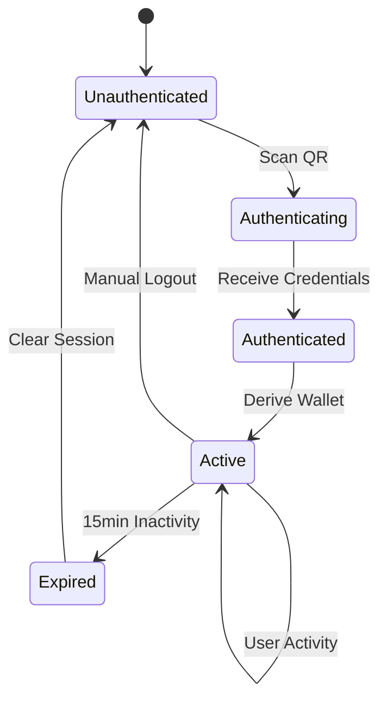
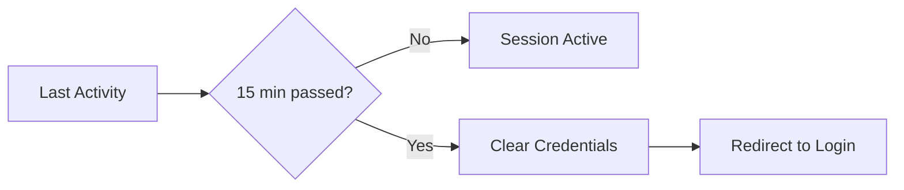

# Session Management

GRIPLOCK implements activity-based session management to balance security with user experience. Sessions automatically expire after inactivity while remaining persistent across page refreshes.

## Session Lifecycle



## Session Properties

| Property | Value | Description |
|----------|-------|-------------|
| TTL | 15 minutes | Time-to-live after last activity |
| Storage | Encrypted localStorage | Persists across page refresh |
| Reset Events | Mouse, click, scroll, keyboard, touch | Any user interaction resets timer |
| Cleanup | Automatic | Expired sessions cleared on check |

## Activity Detection

GRIPLOCK monitors multiple user interaction types to reset the session timer:

```typescript
const activityEvents = [
  'mousemove',
  'click', 
  'scroll',
  'keydown',
  'touchstart'
];

useEffect(() => {
  const handleActivity = () => {
    // Immediately update state (non-throttled)
    setSessionExpiresAt(Date.now() + (15 * 60 * 1000));
    
    // Throttle storage writes to 5 seconds
    throttledStorageUpdate();
  };

  activityEvents.forEach(event => {
    document.addEventListener(event, handleActivity, { passive: true });
  });

  return () => {
    activityEvents.forEach(event => {
      document.removeEventListener(event, handleActivity);
    });
  };
}, []);
```

### Why These Events?

| Event | Rationale |
|-------|-----------|
| `mousemove` | Indicates active viewing/reading |
| `click` | Direct interaction with UI |
| `scroll` | Browsing content |
| `keydown` | Any keyboard input |
| `touchstart` | Mobile device interaction |

## Session Timer Implementation

### State vs Storage Updates

GRIPLOCK separates state updates from storage writes for performance:

```typescript
// Immediate: Update React state
setSessionExpiresAt(Date.now() + TTL);

// Throttled: Write to encrypted storage (every 5 seconds max)
const throttledStorageUpdate = throttle(() => {
  const encrypted = encryptForStorage(walletData, sessionId, 15);
  localStorage.setItem(STORAGE_KEY, JSON.stringify(encrypted));
}, 5000);
```

This ensures:
- UI timer displays accurately
- Storage I/O doesn't impact performance
- Session persists across refresh

### Timer Display

The dashboard shows remaining session time:

```typescript
function SessionTimer({ expiresAt }: { expiresAt: number }) {
  const [remaining, setRemaining] = useState(calculateRemaining());
  
  useEffect(() => {
    const interval = setInterval(() => {
      const timeLeft = expiresAt - Date.now();
      if (timeLeft <= 0) {
        clearWallet(); // Auto-logout
      } else {
        setRemaining(formatTime(timeLeft));
      }
    }, 1000);
    
    return () => clearInterval(interval);
  }, [expiresAt]);
  
  return <span>{remaining}</span>;
}
```

## Session Persistence

### Storage Format

Sessions are stored as encrypted blobs:

```typescript
interface EncryptedStorageData {
  nonce: string;       // AES-GCM nonce (hex)
  ciphertext: string;  // Encrypted payload (hex)
  expiresAt: number;   // Expiration timestamp
}
```

### Encrypted Payload

```typescript
interface StoredWalletData {
  nfcId: string;       // NFC card UID
  pin: string;         // User PIN
  sessionId: string;   // Unique session identifier
  expiresAt: number;   // Expiration timestamp
}
```

### Encryption Key

The storage encryption key is derived from the session ID:

```typescript
function deriveStorageKey(sessionId: string): Uint8Array {
  return hkdf(
    sha256,
    utf8ToBytes(sessionId),
    utf8ToBytes('griplock/storage/v1'),
    utf8ToBytes('griplock/storage-key'),
    32
  );
}
```

This means:
- Session ID is required to decrypt stored credentials
- Different sessions use different encryption keys
- Session ID loss = credentials inaccessible

## Session Restoration

On page load, GRIPLOCK attempts to restore an existing session:

```typescript
function restoreSession(): StoredWalletData | null {
  const stored = localStorage.getItem(STORAGE_KEY);
  if (!stored) return null;
  
  const encrypted = JSON.parse(stored) as EncryptedStorageData;
  
  // Check expiration before decryption
  if (Date.now() > encrypted.expiresAt) {
    localStorage.removeItem(STORAGE_KEY);
    return null;
  }
  
  // Get session ID (stored separately)
  const sessionId = sessionStorage.getItem(SESSION_ID_KEY);
  if (!sessionId) {
    localStorage.removeItem(STORAGE_KEY);
    return null;
  }
  
  // Decrypt and validate
  const data = decryptFromStorage(encrypted, sessionId);
  if (!data || Date.now() > data.expiresAt) {
    localStorage.removeItem(STORAGE_KEY);
    return null;
  }
  
  return data;
}
```

## Security Measures

### Automatic Expiration



### Manual Logout

```typescript
function logout() {
  // Clear all session data
  localStorage.removeItem(STORAGE_KEY);
  sessionStorage.removeItem(SESSION_ID_KEY);
  
  // Zeroize in-memory credentials
  if (walletData) {
    // Clear sensitive fields
    walletData.nfcId = '';
    walletData.pin = '';
  }
  
  // Redirect to login
  setLocation('/');
}
```

### Browser Close Behavior

| Storage Type | Behavior |
|--------------|----------|
| `localStorage` | Persists until expiration or manual clear |
| `sessionStorage` | Cleared when browser tab closes |

The session ID in `sessionStorage` acts as an additional security layer:
- Closing the browser requires re-authentication
- Session data remains encrypted but inaccessible

## Configuration

### TTL Adjustment

The default 15-minute TTL can be configured:

```typescript
const SESSION_TTL_MINUTES = 15;

// For high-security scenarios
const SESSION_TTL_MINUTES = 5;

// For convenience (not recommended for high-value)
const SESSION_TTL_MINUTES = 30;
```

### Activity Throttle

Storage write throttling prevents excessive I/O:

```typescript
const STORAGE_THROTTLE_MS = 5000; // 5 seconds
```

Adjust based on:
- Expected user activity patterns
- Storage performance requirements
- Battery/CPU considerations for mobile

## Edge Cases

<AccordionGroup>
  <Accordion title="Page Refresh During Activity">
    Session survives refresh. The throttled storage write ensures recent activity is persisted. On restore, TTL is reset to full 15 minutes.
  </Accordion>
  <Accordion title="Multiple Tabs">
    Each tab maintains its own session. Storage is shared, but session ID in sessionStorage is per-tab.
  </Accordion>
  <Accordion title="Browser Crash">
    If the browser crashes without a recent storage write, up to 5 seconds of activity may be lost. Session restores to last persisted state.
  </Accordion>
  <Accordion title="Clock Skew">
    Expiration uses `Date.now()` on the client. Large clock changes could cause premature expiration or extended sessions.
  </Accordion>
</AccordionGroup>

## Best Practices

<CardGroup cols={2}>
  <Card title="Logout When Done" icon="right-from-bracket">
    Always manually log out when finished, especially on shared computers
  </Card>
  <Card title="Use Private Browsing" icon="user-secret">
    For maximum security, use incognito/private mode to ensure session data isn't persisted
  </Card>
  <Card title="Monitor Session Timer" icon="clock">
    Keep an eye on the remaining session time displayed in the dashboard
  </Card>
  <Card title="Physical Security" icon="shield">
    Keep your NFC card secure and don't share your PIN
  </Card>
</CardGroup>

## Next Steps

<CardGroup cols={2}>
  <Card title="API Overview" icon="code" href="/api-reference/overview">
    API reference introduction
  </Card>
  <Card title="WebSocket API" icon="plug" href="/api-reference/websocket">
    Signaling server protocol
  </Card>
</CardGroup>
